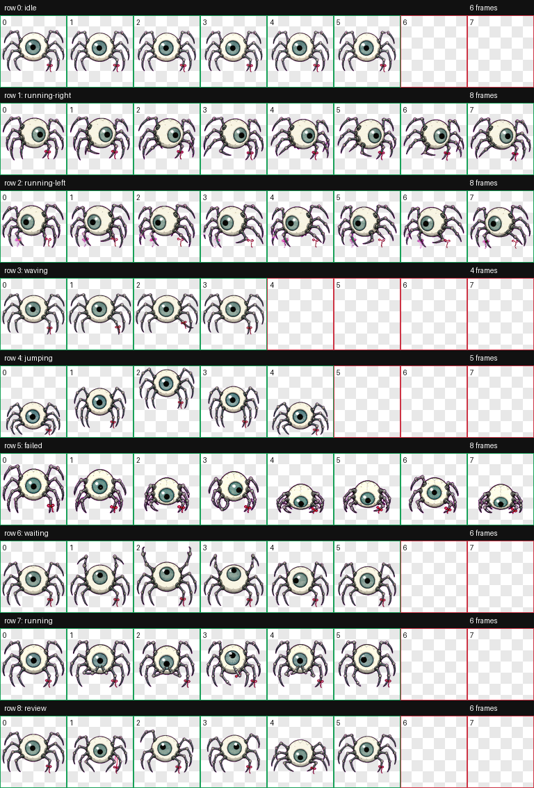
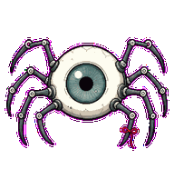
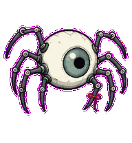
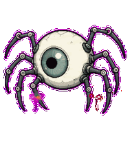
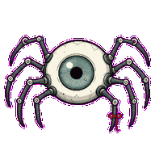
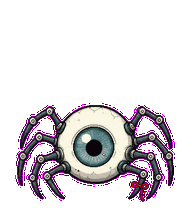
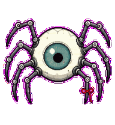
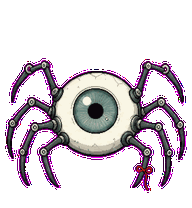
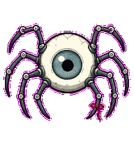
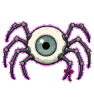

# Pathling Codex Pet

Pathling is a custom Codex pet: a small open-eye spider with a red thread mark.



## Preview

| Idle | Move Right | Move Left |
| --- | --- | --- |
|  |  |  |

| Wave | Jump | Failed |
| --- | --- | --- |
|  |  |  |

| Waiting | Working | Review |
| --- | --- | --- |
|  |  |  |

Pathling keeps one open eye, eight spider legs, and a tiny red thread tied to the lower leg. The "blink" is a pupil-and-iris light response, not an eyelid.

The red thread is an identity mark, so it stays on the same lower-right leg even in the left-running animation.

## Concept

Pathling is not a productivity pet. It is a small local watching mechanism that lives near paths, edges, windows, and repeated behavior. It collects fragments into a nest instead of giving advice.

The longer Chinese concept note is in [docs/CONCEPT.md](docs/CONCEPT.md).

## Install On macOS

Clone or download this repository, then run:

```bash
./install-mac.sh
```

This copies the pet into:

```text
~/.codex/pets/pathling
```

Restart Codex, then open Settings -> Appearance -> Pets and refresh custom pets if Pathling does not appear immediately.

## Manual Install

```bash
mkdir -p ~/.codex/pets
cp -R pets/pathling ~/.codex/pets/pathling
```

The Codex avatar id is:

```text
custom:pathling
```

## Files

- `pets/pathling/pet.json`: Codex pet manifest.
- `pets/pathling/spritesheet.png`: primary `1536x1872` atlas used by `pet.json`.
- `pets/pathling/spritesheet.webp`: WebP copy of the same atlas.
- `qa/contact-sheet.png`: visual QA sheet.
- `qa/previews/*.gif`: row-by-row animation previews.
